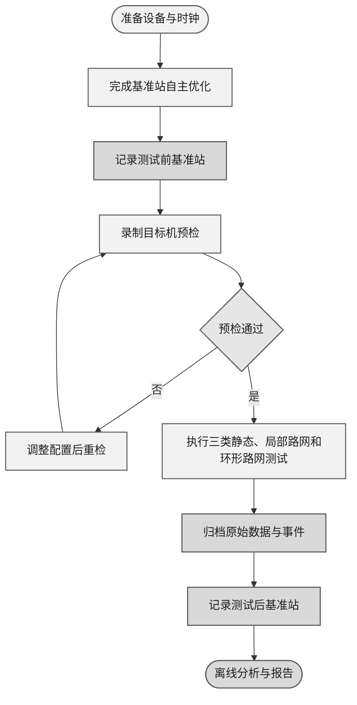

# RTK 定位与航向精度外场测试方案

## 1 测试目的

本测试以 TX100Y 移动站为测试主体，评价其在 TX100J 基准站自主优化和电台差分条件下的定位、航向数据质量及相对定位性能，并形成可复核的原始记录、处理结果和测试结论。

### 1.1 测试目标

- 验证多消息串口配置下的消息完整性、串口带宽、校验和、差分状态与固定解可用性；
- 评估基准站自主优化模式下，整体测试前后定位输出的稳定度；
- 评估移动站在半开阔园区、树冠遮挡区和全开阔无遮挡区固定点位的短时静态散布；
- 评估移动站在半开阔园区局部路网测试中点间距离的一致性；
- 评估移动站在 3–5 km 环形路网中不同环境和距离下的解状态、位置跳变和恢复过程；
- 记录移动站航向解的解状态、航向角、接收机输出的航向精度字段、可用率和连续性。

### 1.2 结论边界

基准站不具备可信控制点，采用静止自主优化。自主优化坐标仅作为同一测试的 ENU 相对参考点，不能作为全球绝对真值。

本方案仅对相对定位重复性、点间距离一致性、前后稳定度、状态可用率和恢复过程作出结论，因无外部绝对坐标参考，接收机输出的位置标准差和航向精度字段作为内部不确定度指标记录，并与基于实际观测数据计算的定位散布、距离一致性和航向重复性分别报告。本次航向测试记录航向解状态、航向角、航向精度字段、可用率、连续性和静态重复性。因无外部航向参考体系；报告中的航向精度为接收机输出字段及其统计结果。

## 2 测试场地、设备与配置

### 2.1 场地与路线

| 项目 | 要求 |
|---|---|
| 基准站位置 | 放置于环形路线覆盖区域的中心附近或边界位置，使用三脚架固定；测试期间不得移动、重启或重新自主优化 |
| 固定点测试 | S1（半开阔园区）、S2（树冠遮挡区）、S3（全开阔无遮挡区）；每点设置稳定物理标记 |
| 局部路网测试 | 半开阔园区内的 L0、L1、L2 闭合路网；三个点构成直角三角形，两条直角边长度均为 10 m；相邻测试点空间距离由独立工具测量 |
| 环形路线动态测试 | 3–5 km 环形路线；按环境类型划分路段 |
| 现场记录 | 日期、时区、天气、路线版本、测试人员、场地照片和异常事件 |

### 2.2 设备清单

| 设备名称 | 数量 | 用途与要求 |
|---|---:|---|
| TX100J 基准站 | 1 套 | 单天线、内置电台、三脚架固定，自主优化后不重置 |
| TX100Y 移动站 | 1 套 | 双天线、内置电台、安装于测试载体，记录主从天线安装位置 |
| 测试笔记本 | 1 台 | 单次只连接基准站或移动站之一，确保系统时间与时区正确 |
| 独立测量工具 | 1 套 | 卷尺或测距仪，用于局部测试路网尺寸记录 |

### 2.3 接收机 COM1 输出配置

| 设备 | 消息 | 目标频率 | 用途 |
|---|---|---:|---|
| 基准站 | `GPGGA`、`BESTPOSA`、`GPGST`、`GPZDA`、`TIMEA` | 1 Hz | 自主优化状态、位置、时间和稳定度检查 |
| 基准站 | `SATSINFOA`、`GPGSA` | 低频 | 卫星与诊断信息 |
| 移动站 | `GPGGA`、`BESTPOSA`、`GPGST`、`UNIHEADINGA` | 10 Hz | 定位、航向、解状态、差分龄期和位置标准差 |
| 移动站 | `GPZDA`、`TIMEA` | 1 Hz | 时间与时间状态 |
| 移动站 | `SATSINFOA`、`GPGSA`、`GNGSVH` | 低频 | 卫星与诊断信息 |

## 3 测试内容与方法

### 3.1 接收机预检

正式测试前，按接收机 COM1 配置对 TX100Y 移动站连续录制 2 分钟。确认实际消息类型和频率、NMEA 校验和、厂家 ASCII CRC、端口头字段、串口总带宽、差分龄期、`BESTPOSA` 状态字段及 `UNIHEADINGA` 字段。基准站的输出完整性在测试前基准站记录中一并检查。

预检未通过时，不进入静态点、局部路网或环形路网测试。若串口带宽不足，可将 `GPGGA`、`BESTPOSA`、`GPGST` 和 `UNIHEADINGA` 的发送频率由 10 Hz 降至 5 Hz，保留 `GPZDA` 和 `TIMEA`，再降低卫星诊断消息频率；调整后的实际配置和预检结果必须归档。

### 3.2 基准站前后检查

在移动站测试开始前和全部测试结束后，分别对基准站连续记录不少于 3 分钟。测试期间基准站位置、天线、电台、供电和自主优化状态不得改变。

以测试前稳定窗口的 ENU 中心为参考，分别计算测试前、测试后窗口的 E/N/U 离散，以及两个窗口稳健中心的 E/N/U 差值和水平差值。同步比较 `BESTPOSA` 状态和位置类型、`GPGST`、卫星数、DOP、`TIMEA` 状态和差分状态。该项用于确认整体测试期间基准站定位输出是否保持稳定。

### 3.3 固定点测试静态重复性

在以下三个区域各设置一个稳定物理标记点：S1 为半开阔园区点位，S2 为树冠遮挡区点位，S3 为全开阔无遮挡点位。每个点位完成 3 次独立停靠。

1. 将移动站天线相位中心的地面投影置于物理标记点
2. 记录开始时的解状态；
3. 静止记录 2 分钟；记录期间不得移动测试载体或改变天线安装状态
4. 若 2 分钟内未达到连续 Fixed，仍记录 2 分钟当前状态数据，并在事件表中记录原因
5. 离开点位后再返回，完成下一次独立停靠

每次停靠分别统计全部有效消息和 Fixed 消息。对 Fixed 稳态统计，丢弃进入 Fixed 后的前 15 秒，使用后续至静态段结束的数据计算 E/N/U 标准差、水平 RMS、水平 P95 离散半径、Fixed 占比和状态持续时间。未获得 Fixed 的点位不以其他状态样本代替 Fixed 统计。

对与静态段时间匹配且 CRC 有效的 `UNIHEADINGA` 消息，记录航向解状态、位置类型、航向角、航向精度字段和基线长度；统计航向有效率、航向精度字段的中位数和 P95。航向角跨越 0°/360° 时采用圆统计方法计算离散度。该项用于评价接收机航向输出的精度字段、可用率和重复性。

### 3.4 局部路网测试点间距离一致性

在半开阔园区内选择 L0、L1、L2 三个稳定停靠点，组成可重复通过的闭合局部测试路网。三个点构成直角三角形，两条直角边长度均为 10 m。对 L0–L1、L1–L2 和 L2–L0 的测试点空间距离，使用钢尺或测距仪独立测量至少 3 次，并记录测量方法和每次结果。以重复测量的平均值作为参考空间距离，以最大值与最小值之差作为重复测量极差；两项结果用于说明独立测量的重复性。

移动站按 `L0 → L1 → L2 → L0` 行驶，每到一点静止记录 60 秒；完成 3 圈。对每个点的 Fixed 静止窗口计算 ENU 稳健中心 `x_i = (E_i, N_i, U_i)`，并计算 `d_rtk(i,j) = ||x_i - x_j||`、距离差 `d_rtk(i,j) - d_reference(i,j)` 以及 L0 首末中心的闭合差。

### 3.5 环形路线动态测试

选择总长度为 3–5 km 的环形路网，起终点为 D0。路线应包含半开阔区、树冠遮挡区和全开阔无遮挡区，并在路线图中记录各环境路段。以测试前基准站稳定窗口的经纬度稳健中心为 ENU 原点，使用移动站有效定位历元计算至基准站的水平距离；测试后基准站记录仅用于稳定度复核。按相同方向完成 2 圈；每圈在 D0 出发前和返回后各静止记录 60 秒。若设置中途停靠点，应记录其位置和静止时长。

| 工况 | 主要观察 |
|---|---|
| 半开阔区 | 定位与航向解状态可用率、卫星数、DOP 和位置变化 |
| 树冠遮挡区 | 定位与航向状态变化、降级历元和恢复时间 |
| 全开阔无遮挡区 | Fixed 连续性、位置变化、航向连续性和恢复完成情况 |

动态期间不需要同时读取基准站串口。以移动站 `BESTPOSA` 的 `solution_status`、`position_type`、差分龄期、基站 ID 和卫星诊断为主要定位证据，以 CRC 有效的 `UNIHEADINGA` 为主要航向证据；基准站前后记录用于排除基准站重启或重新初始化。对每次定位或航向状态切换，记录开始与结束 UTC、空间位置、持续时间、状态切换前后 ENU 位置变化和恢复至 Fixed 的时间。航向统计记录有效航向占比、解状态、航向精度字段和连续性。

## 4 测试流程

### 4.1 测试前准备

- [ ] 基准站三脚架固定，自主优化完成并记录最终经纬高、完成时间和时区
- [ ] 基准站与移动站 COM1 配置已保存，电台频点、协议、天线与供电已核对
- [ ] 串口权限、磁盘空间、系统时间与本地时区已确认
- [ ] S1/S2/S3 静态点和 L0/L1/L2 局部测试路网点位已标记，独立测量记录完整
- [ ] 手机与笔记本时钟对照照片已拍摄

### 4.2 正式测试流程



### 4.3 人工事件与时间对齐

手机时间是人工注释时间，不能直接等同于接收机 UTC。每次会话开始和结束时，应拍摄同时包含人工计时设备和笔记本时间的照片，并记录时区。固定点和路线分段最终以 ENU 轨迹的地理围栏、低速或静止持续时间自动归类，人工时间仅用于复核和记录无法由位置表达的操作。

## 5 离线分析与测试报告

### 5.1 离线分析与轨迹回放命令示例

```bash
python3 scripts/rtk_offline_analysis.py \
  data/rover_YYYYMMDD_HHMMSS.raw \
  --origin LAT LON HEIGHT \
  --csv data/rover_YYYYMMDD_HHMMSS_gga_enu.csv \
  --summary data/rover_YYYYMMDD_HHMMSS_summary.txt

python3 scripts/rtk_amap_view.py \
  data/rover_YYYYMMDD_HHMMSS.raw \
  data/rover_YYYYMMDD_HHMMSS_amap.html
```

离线工具必须先清点消息、校验 NMEA 校验和与厂家 CRC，并确认实际 `BESTPOSA` 字段、端口头和状态值。轨迹地图仅用于回放和诊断，不构成绝对精度证据。

### 5.2 测试报告内容与结果表

测试报告应说明测试对象、基准站型号与配置、场地与路线、测试日期及时区、数据文件、异常事件和结论边界。除另有说明外，所有统计均以校验和或 CRC 有效的消息为样本；定位结果应分别列示全部有效历元和 Fixed 历元，航向结果应单独列示有效 `UNIHEADINGA` 历元。接收机输出的位置标准差和航向精度字段应与基于观测数据计算的统计结果分别列示。

#### 5.2.1 串口预检与数据完整性结果

| 设备与会话 | 原始文件名 | COM1 配置版本 | 计划/实际频率 | NMEA 校验和错误 | 厂家 ASCII CRC 错误 | 平均/峰值带宽 | 差分状态与 Fixed 可用率 | 航向有效率 | 预检结论与备注 |
|---|---|---|---|---:|---:|---|---|---:|---|
| TX100Y 移动站 |  |  |  |  |  |  |  |  |  |
| TX100J 基准站测试前记录 |  |  |  |  |  |  |  | — |  |
| TX100J 基准站测试后记录 |  |  |  |  |  |  |  | — |  |

“计划/实际频率”应按消息类型分别列出；“平均/峰值带宽”以实际串口字节流计算；“航向有效率”定义为 CRC 有效且航向解状态满足目标机预检确认条件的 `UNIHEADINGA` 历元占可匹配历元的比例。

#### 5.2.2 基准站前后稳定度结果

| 检查时段 | 有效历元数 | 主要位置类型与占比 | E/N/U 标准差（m） | 水平稳健中心（m） | 相对测试前中心的 E/N/U 差（m） | 水平差（m） | `GPGST` 水平标准差中位数（m） | 异常与结论 |
|---|---:|---|---|---|---|---:|---:|---|
| 测试前 |  |  |  |  |  | — |  |  |
| 测试后 |  |  |  |  |  |  |  |  |

#### 5.2.3 固定点定位与航向结果

| 点位/试次 | 环境类型 | 全部/Fixed 有效历元数 | Fixed 占比 | E/N/U 标准差（m） | 水平 RMS/P95 半径（m） | 航向解状态与位置类型 | 航向有效率 | 航向精度中位数/P95（°） | 航向圆离散度（°） | 异常与备注 |
|---|---|---|---:|---|---|---|---:|---|---:|---|
| S1-1 | 半开阔园区 |  |  |  |  |  |  |  |  |  |
| S1-2 | 半开阔园区 |  |  |  |  |  |  |  |  |  |
| S1-3 | 半开阔园区 |  |  |  |  |  |  |  |  |  |
| S2-1 | 树冠遮挡区 |  |  |  |  |  |  |  |  |  |
| S2-2 | 树冠遮挡区 |  |  |  |  |  |  |  |  |  |
| S2-3 | 树冠遮挡区 |  |  |  |  |  |  |  |  |  |
| S3-1 | 全开阔无遮挡区 |  |  |  |  |  |  |  |  |  |
| S3-2 | 全开阔无遮挡区 |  |  |  |  |  |  |  |  |  |
| S3-3 | 全开阔无遮挡区 |  |  |  |  |  |  |  |  |  |

航向精度为 `UNIHEADINGA` 输出的航向精度字段。航向圆离散度仅描述同一静态试次内的航向重复性；两项指标应分别列示，不作外部参考条件下的航向评价。

#### 5.2.4 局部路网距离一致性结果

| 圈次 | 路段 | 独立测量方法 | 测量次数 | 参考空间距离（m） | 重复测量极差（m） | RTK 距离（m） | 距离差（m） | L0 首末闭合差（m） | 点位 Fixed 可用率 | 异常与备注 |
|---:|---|---|---:|---:|---:|---:|---:|---:|---:|---|
| 1 | L0–L1 |  |  |  |  |  |  |  |  |  |
| 1 | L1–L2 |  |  |  |  |  |  |  |  |  |
| 1 | L2–L0 |  |  |  |  |  |  |  |  |  |
| 2 | L0–L1 |  |  |  |  |  |  |  |  |  |
| 2 | L1–L2 |  |  |  |  |  |  |  |  |  |
| 2 | L2–L0 |  |  |  |  |  |  |  |  |  |
| 3 | L0–L1 |  |  |  |  |  |  |  |  |  |
| 3 | L1–L2 |  |  |  |  |  |  |  |  |  |
| 3 | L2–L0 |  |  |  |  |  |  |  |  |  |

#### 5.2.5 环形路线动态结果

| 圈次/路段 | 环境类型 | 至基准站水平距离范围（m） | 时长（s） | Fixed 可用率 | 航向有效率 | 主导航向解状态 | 航向精度中位数/P95（°） | 状态切换次数 | 最大位置跳变（m） | 最大恢复至 Fixed 时间（s） | 异常与备注 |
|---|---|---|---:|---:|---:|---|---|---:|---:|---:|---|
| 1 /  |  |  |  |  |  |  |  |  |  |  |  |
| 2 /  |  |  |  |  |  |  |  |  |  |  |  |

状态切换次数、位置跳变和恢复时间应由离线数据计算。至基准站水平距离范围由测试前基准站稳定窗口的经纬度稳健中心与移动站有效定位历元转换至同一 ENU 坐标系后计算。人工填写的北京时间用于标注路段及辅助复核，离线统计的时间基准为接收机或主机接收时间。


## 6 附件

除 6.1 外，本章表中由测试人员现场填写的时间统一使用北京时间（UTC+08:00），格式为 `YYYY-MM-DD HH:MM:SS`。6.1 的 UTC 时间、6.2 的 Fixed 稳态数据时段和第 5 章各项统计结果由原始串口数据离线处理获得；动态路线的人工事件以北京时间记录，并在离线分析时用于检索对应数据段。

### 6.1 基准站前后检查记录表

| 检查时段 | 原始文件名 | 开始 UTC | 结束 UTC | `BESTPOSA` 状态/位置类型 | `GPGST` | 卫星数/DOP | `TIMEA` 状态 | ENU 离散及中心 | 备注 |
|---|---|---|---|---|---|---|---|---|---|
| 测试前 |  |  |  |  |  |  |  |  |  |
| 测试后 |  |  |  |  |  |  |  |  |  |

### 6.2 固定点测试记录表

| 点位 | 环境类型 | 试次 | 原始文件名 | 人工开始/结束时间（北京时间，UTC+08:00） | Fixed 稳态数据时段（UTC） | Fixed 占比 | ENU 离散及中心 | 航向解状态/有效率 | 航向精度中位数/P95（°） | 备注 |
|---|---|---:|---|---|---|---:|---|---|---|---|
| S1 | 半开阔园区 | 1 |  |  |  |  |  |  |  |  |
| S1 | 半开阔园区 | 2 |  |  |  |  |  |  |  |  |
| S1 | 半开阔园区 | 3 |  |  |  |  |  |  |  |  |
| S2 | 树冠遮挡区 | 1 |  |  |  |  |  |  |  |  |
| S2 | 树冠遮挡区 | 2 |  |  |  |  |  |  |  |  |
| S2 | 树冠遮挡区 | 3 |  |  |  |  |  |  |  |  |
| S3 | 全开阔无遮挡区 | 1 |  |  |  |  |  |  |  |  |
| S3 | 全开阔无遮挡区 | 2 |  |  |  |  |  |  |  |  |
| S3 | 全开阔无遮挡区 | 3 |  |  |  |  |  |  |  |  |

### 6.3 局部路网独立测量与循环记录表

#### 6.3.1 独立测量记录

| 路段 | 独立测量方法 | 第 1 次（m） | 第 2 次（m） | 第 3 次（m） | 参考空间距离（m） | 重复测量极差（m） | 测量人员与备注 |
|---|---|---:|---:|---:|---:|---:|---|
| L0–L1 |  |  |  |  |  |  |  |
| L1–L2 |  |  |  |  |  |  |  |
| L2–L0 |  |  |  |  |  |  |  |

#### 6.3.2 循环执行记录

| 圈次 | 人工开始/结束时间（北京时间，UTC+08:00） | 路径 | 移动站原始文件名 | 现场异常与备注 |
|---:|---|---|---|---|
| 1 |  | L0 → L1 → L2 → L0 |  |  |
| 2 |  | L0 → L1 → L2 → L0 |  |  |
| 3 |  | L0 → L1 → L2 → L0 |  |  |

### 6.4 环形路线动态测试现场记录表

| 圈次 | 路段编号 | 环境类型 | 人工进入/离开时间（北京时间，UTC+08:00） | 观察到的事件或操作 | 移动站原始文件名 | 备注 |
|---:|---|---|---|---|---|---|
| 1 |  |  |  |  |  |  |
| 1 |  |  |  |  |  |  |
| 1 |  |  |  |  |  |  |
| 2 |  |  |  |  |  |  |
| 2 |  |  |  |  |  |  |
| 2 |  |  |  |  |  |  |

环境类型统一填写“树冠遮挡区”“半开阔区”或“全开阔无遮挡区”。每圈按预先定义的环境路段逐行记录；发生停车、转弯、通信异常、遮挡条件变化或其他需复核的事件时，应单独记录。

定位与航向解状态、至基准站水平距离、差分龄期、位置跳变和恢复时间均由第 5 章的离线分析结果给出。
